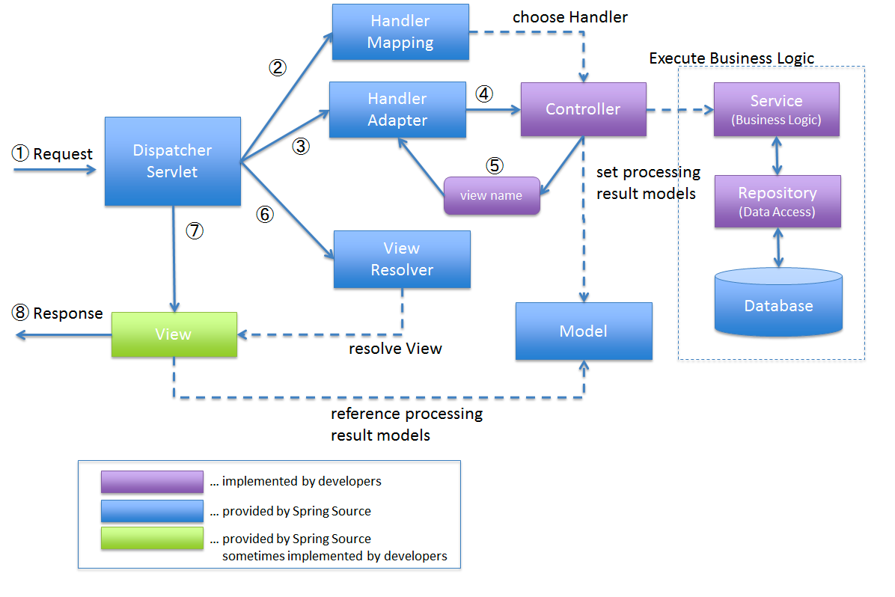

# Spring MVC

[Spring MVC](https://docs.spring.io/spring-framework/reference/web/webmvc.html)는 Servlet API 기반으로 만들어진 Spring 웹 모듈이다.
정식 명칭은 Spring Web MVC (spring-webmvc) Spring MVC 라고 부른다.

## Servlet?
Servlet은 자바를 사용하여 웹페이지를 동적으로 생성하는 서버측 프로그램 혹은 그 사양을 말한다. Servlet은 웹 서버의 성능을 향상하기 위해 사용되는 자바 클래스의 일종이다.

Java Servlet은 자바 EE 사양의 일부분으로, 주로 이 기능을 이용하여 다양한 웹 시스템을 구현한다.

## MVC?
MVC는 소프트웨어를 개발 할 때 적용하는 디자인 패턴 중 하나이다. Model, View, Controller 세 단어의 약자이다.

이 패턴은 관심사를 나누어 Model의 역할은 비즈니스 로직(데이터 등등)을, View는 사용자에게 보여지는 부분, 즉 사용자 인터페이스에 관심을 둔다. Controller은 Model과 View 사이를 연결해주는 역할을 담당하고 있다.

## DispatcherServlet
Spring MVC는 DispatcherServlet이 프론트 컨트롤러 역할을 하고, 실제 요청에 대한 작업은 위임 가능한 컴포넌트들이 처리한다. 이런 위임 가능한 컴포넌트들을 (Special Bean Types)[https://docs.spring.io/spring-framework/reference/web/webmvc/mvc-servlet/special-bean-types.html]라고 부른다.

## Special Bean Types

### HandlerMapping
클라이언트의 요청 URL을 기반으로 어떤 컨트롤러(핸들러)가 요청을 처리할지를 결정하는 역할을 하는 HandlerMapping을 사용합니다.

### HandlerAdapter
실제 컨트롤러(핸들러)가 요청을 처리할 수 있도록 적절한 메서드를 호출하는 역할을 한다.

### HandlerExceptionResolver
예외 처리를 담당하는 인터페이스이다. 이 인터페이스를 구현하는 클래스를 사용하여 컨트롤러(핸들러)에서 발생한 예외를 전역적으로 처리할 수 있다. 

### ViewResolver
핸들러가 처리한 결과를 어떤 뷰에서 보여줄 지를 찾아주는 역할을 한다.  

### LocaleResolver, LocaleContextResolver
국제화를 가능하게 해주는 역할을 한다.

## Spring MVC 흐름도

1. 클라이언트에서 요청이 오면 DispatcherServlet에서 감지.
2. DispatcherServlet은 HandlerMapping을 사용하여 요청한 것을 어떤 컨트롤러가 처리할지 탐색 후 그 정보를 반환.
3. DispatcherServlet은 HandlerAdapter에게 컨트롤러 정보를 전달.
4. HandlerAdapter는 실제 컨트롤러의 메소드를 실행.
5. Controller가 요청을 처리하고 결과에 대한 정보를 리턴. 이때 View, Model 정보를 같이 리턴한다.
6. DispatcherServlet은 ViewResolver를 사용하여 뷰 이름을 실제 뷰 객체로 변환.
7. 선택된 뷰 객체를 사용하여 응답을 생성
8. 생성 된 응답을 클라이언트에게 응답.

# 정리
- Spring MVC는 Servlet API 기반으로 만들어진 웹 모듈이다.
- Servlet은 자바를 사용하여 웹페이지를 동적으로 생성하는 서버프로그래밍이다.
- Spring MVC의 핵심은 DispatcherServlet이다. 대부분의 요청은 DispatcherServlet을 통해 이루어진다.
- 전반적인 처리 흐름은 아래와 같다.
  - DispatcherServlet -> HandlerMapping -> HandlerAdapter -> Controller -> ViewResolver -> View
